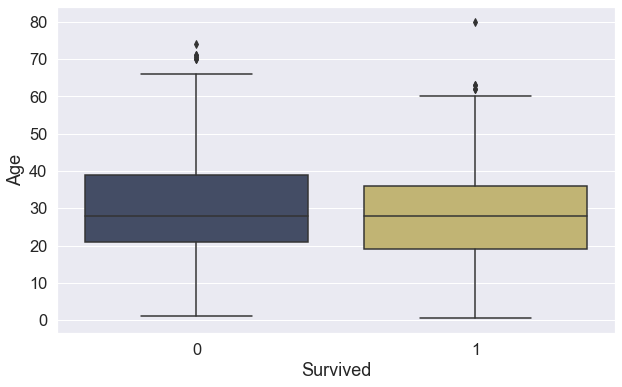

### Dataset features:

* survived: 0 = No, 1 = Yes
* pclass: passanger class
* sex
* age (in years)
* sibsp: # of siblings / spouses aboard the Titanic
* parch: # of parents / children aboard the Titanic
* ticket: Ticket number
* fare: Passenger fare
* cabin: Cabin number
* embarked: Port of Embarkation:
    - C = Cherbourg
    - Q = Queenstown
    - S = Southampton

### Importando os dados


```python
import pandas as pd
import numpy as np
import matplotlib.pyplot as plt
import seaborn as sns
import bokeh
import sklearn
import matplotlib.ticker as mtick
import warnings
warnings.simplefilter("ignore")
```


```python
from bokeh.palettes import Cividis, cividis
from matplotlib.colors import LinearSegmentedColormap
colors = cividis(50)
sns.set_style('darkgrid')
sns.set_palette(colors)
custom_color_map = LinearSegmentedColormap.from_list(name='cividis',colors=colors,)
```


```python
df = pd.read_csv(r'/Users/leuzinger/Dropbox/Data Science/Case idwall/titanic/train.csv')
```


```python
df.head()
```


<div>
<style scoped>
    .dataframe tbody tr th:only-of-type {
        vertical-align: middle;
    }

    .dataframe tbody tr th {
        vertical-align: top;
    }

    .dataframe thead th {
        text-align: right;
    }
</style>
<table border="1" class="dataframe">
  <thead>
    <tr style="text-align: right;">
      <th></th>
      <th>PassengerId</th>
      <th>Survived</th>
      <th>Pclass</th>
      <th>Name</th>
      <th>Sex</th>
      <th>Age</th>
      <th>SibSp</th>
      <th>Parch</th>
      <th>Ticket</th>
      <th>Fare</th>
      <th>Cabin</th>
      <th>Embarked</th>
    </tr>
  </thead>
  <tbody>
    <tr>
      <th>0</th>
      <td>1</td>
      <td>0</td>
      <td>3</td>
      <td>Braund, Mr. Owen Harris</td>
      <td>male</td>
      <td>22.0</td>
      <td>1</td>
      <td>0</td>
      <td>A/5 21171</td>
      <td>7.2500</td>
      <td>NaN</td>
      <td>S</td>
    </tr>
    <tr>
      <th>1</th>
      <td>2</td>
      <td>1</td>
      <td>1</td>
      <td>Cumings, Mrs. John Bradley (Florence Briggs Th...</td>
      <td>female</td>
      <td>38.0</td>
      <td>1</td>
      <td>0</td>
      <td>PC 17599</td>
      <td>71.2833</td>
      <td>C85</td>
      <td>C</td>
    </tr>
    <tr>
      <th>2</th>
      <td>3</td>
      <td>1</td>
      <td>3</td>
      <td>Heikkinen, Miss. Laina</td>
      <td>female</td>
      <td>26.0</td>
      <td>0</td>
      <td>0</td>
      <td>STON/O2. 3101282</td>
      <td>7.9250</td>
      <td>NaN</td>
      <td>S</td>
    </tr>
    <tr>
      <th>3</th>
      <td>4</td>
      <td>1</td>
      <td>1</td>
      <td>Futrelle, Mrs. Jacques Heath (Lily May Peel)</td>
      <td>female</td>
      <td>35.0</td>
      <td>1</td>
      <td>0</td>
      <td>113803</td>
      <td>53.1000</td>
      <td>C123</td>
      <td>S</td>
    </tr>
    <tr>
      <th>4</th>
      <td>5</td>
      <td>0</td>
      <td>3</td>
      <td>Allen, Mr. William Henry</td>
      <td>male</td>
      <td>35.0</td>
      <td>0</td>
      <td>0</td>
      <td>373450</td>
      <td>8.0500</td>
      <td>NaN</td>
      <td>S</td>
    </tr>
  </tbody>
</table>
</div>


```python
df.info()
```

    <class 'pandas.core.frame.DataFrame'>
    RangeIndex: 891 entries, 0 to 890
    Data columns (total 12 columns):
     #   Column       Non-Null Count  Dtype  
    ---  ------       --------------  -----  
     0   PassengerId  891 non-null    int64  
     1   Survived     891 non-null    int64  
     2   Pclass       891 non-null    int64  
     3   Name         891 non-null    object 
     4   Sex          891 non-null    object 
     5   Age          714 non-null    float64
     6   SibSp        891 non-null    int64  
     7   Parch        891 non-null    int64  
     8   Ticket       891 non-null    object 
     9   Fare         891 non-null    float64
     10  Cabin        204 non-null    object 
     11  Embarked     889 non-null    object 
    dtypes: float64(2), int64(5), object(5)
    memory usage: 83.7+ KB


```python
df.describe()
```


<div>
<style scoped>
    .dataframe tbody tr th:only-of-type {
        vertical-align: middle;
    }

    .dataframe tbody tr th {
        vertical-align: top;
    }

    .dataframe thead th {
        text-align: right;
    }
</style>
<table border="1" class="dataframe">
  <thead>
    <tr style="text-align: right;">
      <th></th>
      <th>PassengerId</th>
      <th>Survived</th>
      <th>Pclass</th>
      <th>Age</th>
      <th>SibSp</th>
      <th>Parch</th>
      <th>Fare</th>
    </tr>
  </thead>
  <tbody>
    <tr>
      <th>count</th>
      <td>891.000000</td>
      <td>891.000000</td>
      <td>891.000000</td>
      <td>714.000000</td>
      <td>891.000000</td>
      <td>891.000000</td>
      <td>891.000000</td>
    </tr>
    <tr>
      <th>mean</th>
      <td>446.000000</td>
      <td>0.383838</td>
      <td>2.308642</td>
      <td>29.699118</td>
      <td>0.523008</td>
      <td>0.381594</td>
      <td>32.204208</td>
    </tr>
    <tr>
      <th>std</th>
      <td>257.353842</td>
      <td>0.486592</td>
      <td>0.836071</td>
      <td>14.526497</td>
      <td>1.102743</td>
      <td>0.806057</td>
      <td>49.693429</td>
    </tr>
    <tr>
      <th>min</th>
      <td>1.000000</td>
      <td>0.000000</td>
      <td>1.000000</td>
      <td>0.420000</td>
      <td>0.000000</td>
      <td>0.000000</td>
      <td>0.000000</td>
    </tr>
    <tr>
      <th>25%</th>
      <td>223.500000</td>
      <td>0.000000</td>
      <td>2.000000</td>
      <td>20.125000</td>
      <td>0.000000</td>
      <td>0.000000</td>
      <td>7.910400</td>
    </tr>
    <tr>
      <th>50%</th>
      <td>446.000000</td>
      <td>0.000000</td>
      <td>3.000000</td>
      <td>28.000000</td>
      <td>0.000000</td>
      <td>0.000000</td>
      <td>14.454200</td>
    </tr>
    <tr>
      <th>75%</th>
      <td>668.500000</td>
      <td>1.000000</td>
      <td>3.000000</td>
      <td>38.000000</td>
      <td>1.000000</td>
      <td>0.000000</td>
      <td>31.000000</td>
    </tr>
    <tr>
      <th>max</th>
      <td>891.000000</td>
      <td>1.000000</td>
      <td>3.000000</td>
      <td>80.000000</td>
      <td>8.000000</td>
      <td>6.000000</td>
      <td>512.329200</td>
    </tr>
  </tbody>
</table>
</div>


```python
df['Survived'].value_counts()/df['Survived'].value_counts().sum()
```


    0    0.616162
    1    0.383838
    Name: Survived, dtype: float64


----

Este dataset pode ser considerado desbalanceado? Será que técnicas de oversampling ou undersampling podem melhorar o resultado final do modelo?

----


```python
df.isnull().sum()
```


    PassengerId      0
    Survived         0
    Pclass           0
    Name             0
    Sex              0
    Age            177
    SibSp            0
    Parch            0
    Ticket           0
    Fare             0
    Cabin          687
    Embarked         2
    dtype: int64


----

Estão faltando vários dados de idade, o que pode comprometer o uso dessa variável. O que devemos fazer? 

E o que fazer com os dois valores nulos da variável 'Embarked'? Simplesmente eliminamos ou é melhor usarmos algum imputer?

---


```python
df.duplicated().sum()
```


    0


## Análise exploratória

### Dados gerais


```python
df['Sex'].value_counts()/df['Sex'].value_counts().sum()
```


    male      0.647587
    female    0.352413
    Name: Sex, dtype: float64


```python
figure = plt.figure(figsize=(14,8))
sns.set(font_scale=1.5)
sns.histplot(data=df, x="Age", hue="Sex", kde=True,palette=(colors[1],colors[46]))
plt.show()
```


    

    


```python
figure = plt.figure(figsize=(14,8))
sns.set(font_scale=1.5)
sns.histplot(data=df, x="Age", color="green", hue="Survived", kde=True,palette=(colors[1],colors[46]))
plt.show()
```


    

    


```python
plt.figure(figsize=(10, 10))
sns.set(font_scale=1.5)
sns.heatmap(data=df.corr(),annot=True,vmin=-1,cmap='cividis')
plt.show()
```


    

    


---

Correlações que chamam atenção:

1. Preço e Classe da passagem
2. Parch e SibSp
3. Classe da passagem e sobrevivência

---

### Análise das variáveis contínuas - idade e tarifa


```python
figure = plt.figure(figsize=(10,10))
sns.set(font_scale=1.5)
sns.regplot(data=df,x='Age',y='Fare', color=colors[0],line_kws={'linewidth':4,'color':colors[40]})
plt.show()
```


    

    


```python
figure = plt.figure(figsize=(10,6))
sns.set(font_scale=1.5)
sns.boxplot(data=df, y='Fare',x='Survived',palette=(colors[12],colors[40]))
plt.show()
```


    

    


```python
figure = plt.figure(figsize=(10,6))
sns.set(font_scale=1.5)
sns.boxplot(data=df, y="Age",x='Survived',palette=(colors[12],colors[40]))
plt.show()
```


    

    


```python
figure = plt.figure(figsize=(10,6))
sns.set(font_scale=1.5)
sns.boxplot(data=df, y='Fare',x='Sex',palette=(colors[12],colors[40]))
plt.show()
```


    

    


```python
figure = plt.figure(figsize=(10,6))
sns.set(font_scale=1.5)
sns.boxplot(data=df, y='Age',x='Sex',palette=(colors[12],colors[40]))
plt.show()
```


    

    


### Análise das variáveis categóricas - sexo, classe da passagem, porto de embarque


```python
figure = plt.figure(figsize=(10,6))
sns.set(font_scale=1.5)
ax =sns.barplot(data=df,x='Sex',y='Survived',palette=(colors[12],colors[40]))
ax.yaxis.set_major_formatter(mtick.PercentFormatter(xmax=1))
plt.show()
```


    

    


```python
matriz = pd.DataFrame(index=['No','Yes'],columns=['female','male'])
for i in range(2):
    for j in range(2):
        k =2*i+j
        matriz.iloc[i,j] = df[['Survived','Sex']].value_counts().to_frame().reset_index().sort_values(['Survived','Sex']).iloc[k,2]

figure = plt.figure(figsize=(8,8))
sns.set(font_scale=2)
ax = sns.heatmap(data=matriz.astype(int),annot=True,cmap='cividis',fmt='.0f',square=True)
plt.yticks(np.arange(2)+0.5,rotation=0, fontsize="22", va="center")
ax.set_xlabel("Sex")
ax.set_ylabel("Survived")
plt.show()
```


    

    


```python
figure = plt.figure(figsize=(10,6))
sns.set(font_scale=1.5)
ax = sns.barplot(data=df,x='Pclass',y='Survived',palette=(colors[12],colors[22],colors[40]))
ax.yaxis.set_major_formatter(mtick.PercentFormatter(xmax=1))
plt.show()
```


    

    


```python
matriz = pd.DataFrame(index=['No','Yes'],columns=['1','2','3'])
for i in range(1,4):
    for j in range(2):
        k=i-1
        matriz.iloc[j,k] = df[['Survived','Pclass']].value_counts()[j][i]
        
figure = plt.figure(figsize=(8,8))
sns.set(font_scale=2)
ax = sns.heatmap(data=matriz.astype(int),annot=True,cmap='cividis',fmt='.0f',square=True)
plt.yticks(np.arange(2)+0.5,rotation=0, fontsize="22", va="center")
ax.set_xlabel("Pclass")
ax.set_ylabel("Survived")
plt.show()
```


    

    


```python
figure = plt.figure(figsize=(14,6))
sns.set(font_scale=1.5)
ax = sns.barplot(data=df,x='Embarked',y='Survived',palette=(colors[12],colors[22],colors[40]))
ax.yaxis.set_major_formatter(mtick.PercentFormatter(xmax=1))
plt.show()
```


    

    


```python
matriz = pd.DataFrame(index=['No','Yes'],columns=['S','C','Q'])
for i in range(3):
    for j in range(2):
        matriz.iloc[j,i] = df[['Survived','Embarked']].value_counts()[j][i]
        
figure = plt.figure(figsize=(8,8))
sns.set(font_scale=2)
ax = sns.heatmap(data=matriz.astype(int),annot=True,cmap='cividis',fmt='.0f',square=True)
plt.yticks(np.arange(2)+0.5,rotation=0, fontsize="22", va="center")
ax.set_xlabel("Embarked")
ax.set_ylabel("Survived")
plt.show()
```


    

    


```python
df_plot = df[['Embarked','Pclass']].value_counts().to_frame().reset_index()
df_plot.columns = ['Embarked', 'Pclass', 'count']

figure = plt.figure(figsize=(14,8))
sns.set(font_scale=1.5)
ax = sns.barplot(data=df_plot,x='Embarked',y='count',hue='Pclass',palette=(colors[12],colors[22],colors[40]))
#ax.yaxis.set_major_formatter(mtick.PercentFormatter(xmax=1))
plt.show()
```


    

    


```python
df_plot = df[['Embarked','Sex']].value_counts().to_frame().reset_index()
df_plot.columns = ['Embarked', 'Sex', 'count']

figure = plt.figure(figsize=(14,8))
sns.set(font_scale=1.5)
ax = sns.barplot(data=df_plot,x='Embarked',y='count',hue='Sex',palette=(colors[12],colors[40]))
#ax.yaxis.set_major_formatter(mtick.PercentFormatter(xmax=1))
plt.show()
```


    

    


### Análise das variáveis categóricas - passageiros com e sem cabine


```python
df['Cabin']
```


    0       NaN
    1       C85
    2       NaN
    3      C123
    4       NaN
           ... 
    886     NaN
    887     B42
    888     NaN
    889    C148
    890     NaN
    Name: Cabin, Length: 891, dtype: object


```python
df['check_cabin'] = df['Cabin']

for i in range(len(df['check_cabin'])):
    if pd.isna(df.iloc[i,10]):
        df.iloc[i,12] = 'No'
    else:
        df.iloc[i,12] = 'Yes'
        
figure = plt.figure(figsize=(10,6))
sns.set(font_scale=1.5)
ax =sns.barplot(data=df,x='check_cabin',y='Survived',palette=(colors[12],colors[40]))
ax.yaxis.set_major_formatter(mtick.PercentFormatter(xmax=1))
plt.show()
```


    

    


```python
matriz = pd.DataFrame(index=['No','Yes'],columns=['No','Yes'])
for i in range(2):
    for j in range(2):
        k = 2*i+j
        matriz.iloc[i,j] = df[['Survived','check_cabin']].value_counts().reset_index().sort_values('Survived').iloc[k,2]

figure = plt.figure(figsize=(8,8))
sns.set(font_scale=2)
ax=sns.heatmap(data=matriz.astype(int),annot=True,cmap='cividis',fmt='.0f',square=True)
#plt.xticks(np.arange(2)+0.5,rotation=0, fontsize="25", va="center_baseline")
plt.yticks(np.arange(2)+0.5,rotation=0, fontsize="22", va="center")
ax.set_xlabel("Cabin")
ax.set_ylabel("Survived")
plt.show()
```


    

    


```python
df_plot = df[['check_cabin','Pclass']].value_counts().to_frame().reset_index()
df_plot.columns = ['check_cabin', 'Pclass', 'count']

figure = plt.figure(figsize=(10,6))
sns.set(font_scale=1.5)
ax = sns.barplot(data=df_plot,x='check_cabin',y='count',hue='Pclass',palette=(colors[12],colors[22],colors[40]))
plt.show()
```


    

    


```python
df[(df['check_cabin']=='Yes') & (df['Pclass']==3)]
```


<div>
<style scoped>
    .dataframe tbody tr th:only-of-type {
        vertical-align: middle;
    }

    .dataframe tbody tr th {
        vertical-align: top;
    }

    .dataframe thead th {
        text-align: right;
    }
</style>
<table border="1" class="dataframe">
  <thead>
    <tr style="text-align: right;">
      <th></th>
      <th>PassengerId</th>
      <th>Survived</th>
      <th>Pclass</th>
      <th>Name</th>
      <th>Sex</th>
      <th>Age</th>
      <th>SibSp</th>
      <th>Parch</th>
      <th>Ticket</th>
      <th>Fare</th>
      <th>Cabin</th>
      <th>Embarked</th>
      <th>check_cabin</th>
    </tr>
  </thead>
  <tbody>
    <tr>
      <th>10</th>
      <td>11</td>
      <td>1</td>
      <td>3</td>
      <td>Sandstrom, Miss. Marguerite Rut</td>
      <td>female</td>
      <td>4.0</td>
      <td>1</td>
      <td>1</td>
      <td>PP 9549</td>
      <td>16.7000</td>
      <td>G6</td>
      <td>S</td>
      <td>Yes</td>
    </tr>
    <tr>
      <th>75</th>
      <td>76</td>
      <td>0</td>
      <td>3</td>
      <td>Moen, Mr. Sigurd Hansen</td>
      <td>male</td>
      <td>25.0</td>
      <td>0</td>
      <td>0</td>
      <td>348123</td>
      <td>7.6500</td>
      <td>F G73</td>
      <td>S</td>
      <td>Yes</td>
    </tr>
    <tr>
      <th>128</th>
      <td>129</td>
      <td>1</td>
      <td>3</td>
      <td>Peter, Miss. Anna</td>
      <td>female</td>
      <td>NaN</td>
      <td>1</td>
      <td>1</td>
      <td>2668</td>
      <td>22.3583</td>
      <td>F E69</td>
      <td>C</td>
      <td>Yes</td>
    </tr>
    <tr>
      <th>205</th>
      <td>206</td>
      <td>0</td>
      <td>3</td>
      <td>Strom, Miss. Telma Matilda</td>
      <td>female</td>
      <td>2.0</td>
      <td>0</td>
      <td>1</td>
      <td>347054</td>
      <td>10.4625</td>
      <td>G6</td>
      <td>S</td>
      <td>Yes</td>
    </tr>
    <tr>
      <th>251</th>
      <td>252</td>
      <td>0</td>
      <td>3</td>
      <td>Strom, Mrs. Wilhelm (Elna Matilda Persson)</td>
      <td>female</td>
      <td>29.0</td>
      <td>1</td>
      <td>1</td>
      <td>347054</td>
      <td>10.4625</td>
      <td>G6</td>
      <td>S</td>
      <td>Yes</td>
    </tr>
    <tr>
      <th>394</th>
      <td>395</td>
      <td>1</td>
      <td>3</td>
      <td>Sandstrom, Mrs. Hjalmar (Agnes Charlotta Bengt...</td>
      <td>female</td>
      <td>24.0</td>
      <td>0</td>
      <td>2</td>
      <td>PP 9549</td>
      <td>16.7000</td>
      <td>G6</td>
      <td>S</td>
      <td>Yes</td>
    </tr>
    <tr>
      <th>429</th>
      <td>430</td>
      <td>1</td>
      <td>3</td>
      <td>Pickard, Mr. Berk (Berk Trembisky)</td>
      <td>male</td>
      <td>32.0</td>
      <td>0</td>
      <td>0</td>
      <td>SOTON/O.Q. 392078</td>
      <td>8.0500</td>
      <td>E10</td>
      <td>S</td>
      <td>Yes</td>
    </tr>
    <tr>
      <th>699</th>
      <td>700</td>
      <td>0</td>
      <td>3</td>
      <td>Humblen, Mr. Adolf Mathias Nicolai Olsen</td>
      <td>male</td>
      <td>42.0</td>
      <td>0</td>
      <td>0</td>
      <td>348121</td>
      <td>7.6500</td>
      <td>F G63</td>
      <td>S</td>
      <td>Yes</td>
    </tr>
    <tr>
      <th>715</th>
      <td>716</td>
      <td>0</td>
      <td>3</td>
      <td>Soholt, Mr. Peter Andreas Lauritz Andersen</td>
      <td>male</td>
      <td>19.0</td>
      <td>0</td>
      <td>0</td>
      <td>348124</td>
      <td>7.6500</td>
      <td>F G73</td>
      <td>S</td>
      <td>Yes</td>
    </tr>
    <tr>
      <th>751</th>
      <td>752</td>
      <td>1</td>
      <td>3</td>
      <td>Moor, Master. Meier</td>
      <td>male</td>
      <td>6.0</td>
      <td>0</td>
      <td>1</td>
      <td>392096</td>
      <td>12.4750</td>
      <td>E121</td>
      <td>S</td>
      <td>Yes</td>
    </tr>
    <tr>
      <th>776</th>
      <td>777</td>
      <td>0</td>
      <td>3</td>
      <td>Tobin, Mr. Roger</td>
      <td>male</td>
      <td>NaN</td>
      <td>0</td>
      <td>0</td>
      <td>383121</td>
      <td>7.7500</td>
      <td>F38</td>
      <td>Q</td>
      <td>Yes</td>
    </tr>
    <tr>
      <th>823</th>
      <td>824</td>
      <td>1</td>
      <td>3</td>
      <td>Moor, Mrs. (Beila)</td>
      <td>female</td>
      <td>27.0</td>
      <td>0</td>
      <td>1</td>
      <td>392096</td>
      <td>12.4750</td>
      <td>E121</td>
      <td>S</td>
      <td>Yes</td>
    </tr>
  </tbody>
</table>
</div>


```python
df_plot = df[['check_cabin','Sex']].value_counts().to_frame().reset_index()
df_plot.columns = ['check_cabin', 'Sex', 'count']

figure = plt.figure(figsize=(10,6))
sns.set(font_scale=1.5)
ax = sns.barplot(data=df_plot,x='check_cabin',y='count',hue='Sex',palette=(colors[12],colors[40]))
plt.show()
```


    

    


```python
figure = plt.figure(figsize=(14,8))

sns.set(font_scale=1.5)
sns.histplot(data=df[df['check_cabin']=='No']['Age'].to_frame(),x='Age',bins=range(0,80,5),kde=True,color=(colors[1]))
sns.histplot(data=df[df['check_cabin']=='Yes']['Age'].to_frame(),x='Age',bins=range(0,80,5),kde=True,color=(colors[46]))
plt.legend(['sem cabine','com cabine'])
plt.show()
```


    

    


### Análise das variáveis - Identificação de famílias


```python
df['Surname'] = pd.DataFrame(df['Name'].str.split(',').tolist())[0]
df['Surname'].nunique()
```


    667


```python
df[df['Surname']=='Andersson']
```


<div>
<style scoped>
    .dataframe tbody tr th:only-of-type {
        vertical-align: middle;
    }

    .dataframe tbody tr th {
        vertical-align: top;
    }

    .dataframe thead th {
        text-align: right;
    }
</style>
<table border="1" class="dataframe">
  <thead>
    <tr style="text-align: right;">
      <th></th>
      <th>PassengerId</th>
      <th>Survived</th>
      <th>Pclass</th>
      <th>Name</th>
      <th>Sex</th>
      <th>Age</th>
      <th>SibSp</th>
      <th>Parch</th>
      <th>Ticket</th>
      <th>Fare</th>
      <th>Cabin</th>
      <th>Embarked</th>
      <th>check_cabin</th>
      <th>Surname</th>
    </tr>
  </thead>
  <tbody>
    <tr>
      <th>13</th>
      <td>14</td>
      <td>0</td>
      <td>3</td>
      <td>Andersson, Mr. Anders Johan</td>
      <td>male</td>
      <td>39.0</td>
      <td>1</td>
      <td>5</td>
      <td>347082</td>
      <td>31.2750</td>
      <td>NaN</td>
      <td>S</td>
      <td>No</td>
      <td>Andersson</td>
    </tr>
    <tr>
      <th>68</th>
      <td>69</td>
      <td>1</td>
      <td>3</td>
      <td>Andersson, Miss. Erna Alexandra</td>
      <td>female</td>
      <td>17.0</td>
      <td>4</td>
      <td>2</td>
      <td>3101281</td>
      <td>7.9250</td>
      <td>NaN</td>
      <td>S</td>
      <td>No</td>
      <td>Andersson</td>
    </tr>
    <tr>
      <th>119</th>
      <td>120</td>
      <td>0</td>
      <td>3</td>
      <td>Andersson, Miss. Ellis Anna Maria</td>
      <td>female</td>
      <td>2.0</td>
      <td>4</td>
      <td>2</td>
      <td>347082</td>
      <td>31.2750</td>
      <td>NaN</td>
      <td>S</td>
      <td>No</td>
      <td>Andersson</td>
    </tr>
    <tr>
      <th>146</th>
      <td>147</td>
      <td>1</td>
      <td>3</td>
      <td>Andersson, Mr. August Edvard ("Wennerstrom")</td>
      <td>male</td>
      <td>27.0</td>
      <td>0</td>
      <td>0</td>
      <td>350043</td>
      <td>7.7958</td>
      <td>NaN</td>
      <td>S</td>
      <td>No</td>
      <td>Andersson</td>
    </tr>
    <tr>
      <th>541</th>
      <td>542</td>
      <td>0</td>
      <td>3</td>
      <td>Andersson, Miss. Ingeborg Constanzia</td>
      <td>female</td>
      <td>9.0</td>
      <td>4</td>
      <td>2</td>
      <td>347082</td>
      <td>31.2750</td>
      <td>NaN</td>
      <td>S</td>
      <td>No</td>
      <td>Andersson</td>
    </tr>
    <tr>
      <th>542</th>
      <td>543</td>
      <td>0</td>
      <td>3</td>
      <td>Andersson, Miss. Sigrid Elisabeth</td>
      <td>female</td>
      <td>11.0</td>
      <td>4</td>
      <td>2</td>
      <td>347082</td>
      <td>31.2750</td>
      <td>NaN</td>
      <td>S</td>
      <td>No</td>
      <td>Andersson</td>
    </tr>
    <tr>
      <th>610</th>
      <td>611</td>
      <td>0</td>
      <td>3</td>
      <td>Andersson, Mrs. Anders Johan (Alfrida Konstant...</td>
      <td>female</td>
      <td>39.0</td>
      <td>1</td>
      <td>5</td>
      <td>347082</td>
      <td>31.2750</td>
      <td>NaN</td>
      <td>S</td>
      <td>No</td>
      <td>Andersson</td>
    </tr>
    <tr>
      <th>813</th>
      <td>814</td>
      <td>0</td>
      <td>3</td>
      <td>Andersson, Miss. Ebba Iris Alfrida</td>
      <td>female</td>
      <td>6.0</td>
      <td>4</td>
      <td>2</td>
      <td>347082</td>
      <td>31.2750</td>
      <td>NaN</td>
      <td>S</td>
      <td>No</td>
      <td>Andersson</td>
    </tr>
    <tr>
      <th>850</th>
      <td>851</td>
      <td>0</td>
      <td>3</td>
      <td>Andersson, Master. Sigvard Harald Elias</td>
      <td>male</td>
      <td>4.0</td>
      <td>4</td>
      <td>2</td>
      <td>347082</td>
      <td>31.2750</td>
      <td>NaN</td>
      <td>S</td>
      <td>No</td>
      <td>Andersson</td>
    </tr>
  </tbody>
</table>
</div>


```python
df[df['Surname']=='Sage']
```


<div>
<style scoped>
    .dataframe tbody tr th:only-of-type {
        vertical-align: middle;
    }

    .dataframe tbody tr th {
        vertical-align: top;
    }

    .dataframe thead th {
        text-align: right;
    }
</style>
<table border="1" class="dataframe">
  <thead>
    <tr style="text-align: right;">
      <th></th>
      <th>PassengerId</th>
      <th>Survived</th>
      <th>Pclass</th>
      <th>Name</th>
      <th>Sex</th>
      <th>Age</th>
      <th>SibSp</th>
      <th>Parch</th>
      <th>Ticket</th>
      <th>Fare</th>
      <th>Cabin</th>
      <th>Embarked</th>
      <th>check_cabin</th>
      <th>Surname</th>
    </tr>
  </thead>
  <tbody>
    <tr>
      <th>159</th>
      <td>160</td>
      <td>0</td>
      <td>3</td>
      <td>Sage, Master. Thomas Henry</td>
      <td>male</td>
      <td>NaN</td>
      <td>8</td>
      <td>2</td>
      <td>CA. 2343</td>
      <td>69.55</td>
      <td>NaN</td>
      <td>S</td>
      <td>No</td>
      <td>Sage</td>
    </tr>
    <tr>
      <th>180</th>
      <td>181</td>
      <td>0</td>
      <td>3</td>
      <td>Sage, Miss. Constance Gladys</td>
      <td>female</td>
      <td>NaN</td>
      <td>8</td>
      <td>2</td>
      <td>CA. 2343</td>
      <td>69.55</td>
      <td>NaN</td>
      <td>S</td>
      <td>No</td>
      <td>Sage</td>
    </tr>
    <tr>
      <th>201</th>
      <td>202</td>
      <td>0</td>
      <td>3</td>
      <td>Sage, Mr. Frederick</td>
      <td>male</td>
      <td>NaN</td>
      <td>8</td>
      <td>2</td>
      <td>CA. 2343</td>
      <td>69.55</td>
      <td>NaN</td>
      <td>S</td>
      <td>No</td>
      <td>Sage</td>
    </tr>
    <tr>
      <th>324</th>
      <td>325</td>
      <td>0</td>
      <td>3</td>
      <td>Sage, Mr. George John Jr</td>
      <td>male</td>
      <td>NaN</td>
      <td>8</td>
      <td>2</td>
      <td>CA. 2343</td>
      <td>69.55</td>
      <td>NaN</td>
      <td>S</td>
      <td>No</td>
      <td>Sage</td>
    </tr>
    <tr>
      <th>792</th>
      <td>793</td>
      <td>0</td>
      <td>3</td>
      <td>Sage, Miss. Stella Anna</td>
      <td>female</td>
      <td>NaN</td>
      <td>8</td>
      <td>2</td>
      <td>CA. 2343</td>
      <td>69.55</td>
      <td>NaN</td>
      <td>S</td>
      <td>No</td>
      <td>Sage</td>
    </tr>
    <tr>
      <th>846</th>
      <td>847</td>
      <td>0</td>
      <td>3</td>
      <td>Sage, Mr. Douglas Bullen</td>
      <td>male</td>
      <td>NaN</td>
      <td>8</td>
      <td>2</td>
      <td>CA. 2343</td>
      <td>69.55</td>
      <td>NaN</td>
      <td>S</td>
      <td>No</td>
      <td>Sage</td>
    </tr>
    <tr>
      <th>863</th>
      <td>864</td>
      <td>0</td>
      <td>3</td>
      <td>Sage, Miss. Dorothy Edith "Dolly"</td>
      <td>female</td>
      <td>NaN</td>
      <td>8</td>
      <td>2</td>
      <td>CA. 2343</td>
      <td>69.55</td>
      <td>NaN</td>
      <td>S</td>
      <td>No</td>
      <td>Sage</td>
    </tr>
  </tbody>
</table>
</div>


```python
df[df['Surname']=='Skoog']
```


<div>
<style scoped>
    .dataframe tbody tr th:only-of-type {
        vertical-align: middle;
    }

    .dataframe tbody tr th {
        vertical-align: top;
    }

    .dataframe thead th {
        text-align: right;
    }
</style>
<table border="1" class="dataframe">
  <thead>
    <tr style="text-align: right;">
      <th></th>
      <th>PassengerId</th>
      <th>Survived</th>
      <th>Pclass</th>
      <th>Name</th>
      <th>Sex</th>
      <th>Age</th>
      <th>SibSp</th>
      <th>Parch</th>
      <th>Ticket</th>
      <th>Fare</th>
      <th>Cabin</th>
      <th>Embarked</th>
      <th>check_cabin</th>
      <th>Surname</th>
    </tr>
  </thead>
  <tbody>
    <tr>
      <th>63</th>
      <td>64</td>
      <td>0</td>
      <td>3</td>
      <td>Skoog, Master. Harald</td>
      <td>male</td>
      <td>4.0</td>
      <td>3</td>
      <td>2</td>
      <td>347088</td>
      <td>27.9</td>
      <td>NaN</td>
      <td>S</td>
      <td>No</td>
      <td>Skoog</td>
    </tr>
    <tr>
      <th>167</th>
      <td>168</td>
      <td>0</td>
      <td>3</td>
      <td>Skoog, Mrs. William (Anna Bernhardina Karlsson)</td>
      <td>female</td>
      <td>45.0</td>
      <td>1</td>
      <td>4</td>
      <td>347088</td>
      <td>27.9</td>
      <td>NaN</td>
      <td>S</td>
      <td>No</td>
      <td>Skoog</td>
    </tr>
    <tr>
      <th>360</th>
      <td>361</td>
      <td>0</td>
      <td>3</td>
      <td>Skoog, Mr. Wilhelm</td>
      <td>male</td>
      <td>40.0</td>
      <td>1</td>
      <td>4</td>
      <td>347088</td>
      <td>27.9</td>
      <td>NaN</td>
      <td>S</td>
      <td>No</td>
      <td>Skoog</td>
    </tr>
    <tr>
      <th>634</th>
      <td>635</td>
      <td>0</td>
      <td>3</td>
      <td>Skoog, Miss. Mabel</td>
      <td>female</td>
      <td>9.0</td>
      <td>3</td>
      <td>2</td>
      <td>347088</td>
      <td>27.9</td>
      <td>NaN</td>
      <td>S</td>
      <td>No</td>
      <td>Skoog</td>
    </tr>
    <tr>
      <th>642</th>
      <td>643</td>
      <td>0</td>
      <td>3</td>
      <td>Skoog, Miss. Margit Elizabeth</td>
      <td>female</td>
      <td>2.0</td>
      <td>3</td>
      <td>2</td>
      <td>347088</td>
      <td>27.9</td>
      <td>NaN</td>
      <td>S</td>
      <td>No</td>
      <td>Skoog</td>
    </tr>
    <tr>
      <th>819</th>
      <td>820</td>
      <td>0</td>
      <td>3</td>
      <td>Skoog, Master. Karl Thorsten</td>
      <td>male</td>
      <td>10.0</td>
      <td>3</td>
      <td>2</td>
      <td>347088</td>
      <td>27.9</td>
      <td>NaN</td>
      <td>S</td>
      <td>No</td>
      <td>Skoog</td>
    </tr>
  </tbody>
</table>
</div>


---

Como tratar as variáveis categóricas? 

Usar o Label enconder ou o OneHot Enconder?

---


```python
df['Ticket'].nunique()
```


    681


---

Usar ticket + sobrenome para identificar as famílias?

---

### Preparação dos dados para o modelo


```python
df_prep = df.copy()
df_prep['Cabin'] = df_prep['Cabin'].replace(to_replace=np.nan,value='sem cabine')
```


```python
from sklearn.preprocessing import LabelEncoder,LabelBinarizer

encoder = LabelEncoder()
surname = encoder.fit_transform(df['Surname'])
ticket = encoder.fit_transform(df['Ticket'])
cabin = encoder.fit_transform(df['Cabin'])
embarked = encoder.fit_transform(df['Embarked'])
enconder2 = LabelBinarizer()
sex = enconder2.fit_transform(df['Sex'])
cabin = enconder2.fit_transform(df['check_cabin'])
```


```python
df_prep['Surname'] = surname
df_prep['Ticket'] = ticket
df_prep['Sex'] = sex
df_prep['Cabin'] = cabin
df_prep['Embarked'] = embarked
df_prep['check_cabin'] = cabin
df_prep = df_prep.drop(['PassengerId','Name'],axis=1)
```


```python
df_prep.info()
```

    <class 'pandas.core.frame.DataFrame'>
    RangeIndex: 891 entries, 0 to 890
    Data columns (total 12 columns):
     #   Column       Non-Null Count  Dtype  
    ---  ------       --------------  -----  
     0   Survived     891 non-null    int64  
     1   Pclass       891 non-null    int64  
     2   Sex          891 non-null    int64  
     3   Age          714 non-null    float64
     4   SibSp        891 non-null    int64  
     5   Parch        891 non-null    int64  
     6   Ticket       891 non-null    int64  
     7   Fare         891 non-null    float64
     8   Cabin        891 non-null    int64  
     9   Embarked     891 non-null    int64  
     10  check_cabin  891 non-null    int64  
     11  Surname      891 non-null    int64  
    dtypes: float64(2), int64(10)
    memory usage: 83.7 KB


```python
df_prep.head()
```


<div>
<style scoped>
    .dataframe tbody tr th:only-of-type {
        vertical-align: middle;
    }

    .dataframe tbody tr th {
        vertical-align: top;
    }

    .dataframe thead th {
        text-align: right;
    }
</style>
<table border="1" class="dataframe">
  <thead>
    <tr style="text-align: right;">
      <th></th>
      <th>Survived</th>
      <th>Pclass</th>
      <th>Sex</th>
      <th>Age</th>
      <th>SibSp</th>
      <th>Parch</th>
      <th>Ticket</th>
      <th>Fare</th>
      <th>Cabin</th>
      <th>Embarked</th>
      <th>check_cabin</th>
      <th>Surname</th>
    </tr>
  </thead>
  <tbody>
    <tr>
      <th>0</th>
      <td>0</td>
      <td>3</td>
      <td>1</td>
      <td>22.0</td>
      <td>1</td>
      <td>0</td>
      <td>523</td>
      <td>7.2500</td>
      <td>0</td>
      <td>2</td>
      <td>0</td>
      <td>73</td>
    </tr>
    <tr>
      <th>1</th>
      <td>1</td>
      <td>1</td>
      <td>0</td>
      <td>38.0</td>
      <td>1</td>
      <td>0</td>
      <td>596</td>
      <td>71.2833</td>
      <td>1</td>
      <td>0</td>
      <td>1</td>
      <td>136</td>
    </tr>
    <tr>
      <th>2</th>
      <td>1</td>
      <td>3</td>
      <td>0</td>
      <td>26.0</td>
      <td>0</td>
      <td>0</td>
      <td>669</td>
      <td>7.9250</td>
      <td>0</td>
      <td>2</td>
      <td>0</td>
      <td>251</td>
    </tr>
    <tr>
      <th>3</th>
      <td>1</td>
      <td>1</td>
      <td>0</td>
      <td>35.0</td>
      <td>1</td>
      <td>0</td>
      <td>49</td>
      <td>53.1000</td>
      <td>1</td>
      <td>2</td>
      <td>1</td>
      <td>198</td>
    </tr>
    <tr>
      <th>4</th>
      <td>0</td>
      <td>3</td>
      <td>1</td>
      <td>35.0</td>
      <td>0</td>
      <td>0</td>
      <td>472</td>
      <td>8.0500</td>
      <td>0</td>
      <td>2</td>
      <td>0</td>
      <td>11</td>
    </tr>
  </tbody>
</table>
</div>


### Construção do modelo


```python
from sklearn.model_selection import train_test_split

df_prep_X = df_prep.drop('Survived',axis=1)
df_prep_y = df_prep['Survived']

df_prep_X_train, df_prep_X_test, df_prep_y_train, df_prep_y_test = train_test_split(df_prep_X, df_prep_y, test_size=0.2,stratify=df_prep_y)
```

### 1. XGBoost


```python
from sklearn.preprocessing import StandardScaler
from sklearn.pipeline import Pipeline
from xgboost import XGBClassifier

scaler = StandardScaler()
model = XGBClassifier()

steps=[('scaler',scaler),('model',model)]
pipe = Pipeline(steps=steps)

        
pipe.fit(df_prep_X_train,df_prep_y_train)
df_prep_ypred_train = pipe.predict(df_prep_X_train)
```

    [09:25:45] WARNING: /Users/travis/build/dmlc/xgboost/src/learner.cc:1095: Starting in XGBoost 1.3.0, the default evaluation metric used with the objective 'binary:logistic' was changed from 'error' to 'logloss'. Explicitly set eval_metric if you'd like to restore the old behavior.


---

Qual métrica de erro deveríamos utilizar? Acurácia? F1? Outra? Alguma das categorias é mais importante do que a outra para este problema?

---


```python
from sklearn.metrics import accuracy_score, f1_score, fbeta_score

print('Acurácia: %f'% accuracy_score(df_prep_y_train,df_prep_ypred_train))
print('F1-score: %f'% f1_score(df_prep_y_train,df_prep_ypred_train))
```

    Acurácia: 0.998596
    F1-score: 0.998172


```python
from sklearn.metrics import confusion_matrix

categories = ['did not survive','survived']

figure = plt.figure(figsize=(10,10))
ax = sns.heatmap(data=confusion_matrix(df_prep_y_train,df_prep_ypred_train),
                 annot=True,cmap='cividis',fmt='.0f',square=True,
                 xticklabels=categories,yticklabels=categories)

plt.yticks(np.arange(2)+0.5,rotation=0, fontsize="22", va="center")
ax.set_title("Confusion matrix")
ax.set_xlabel("Predicted label")
ax.set_ylabel("True label")

plt.show()
```


    

    


---

Como resolver o overfitting? Usar outro modelo?

---


```python
pd.DataFrame(model.feature_importances_,columns=['importance']).join(df_prep_X_train.columns.to_frame(name='features').reset_index(drop=True)).sort_values('importance',ascending=False)
```


<div>
<style scoped>
    .dataframe tbody tr th:only-of-type {
        vertical-align: middle;
    }

    .dataframe tbody tr th {
        vertical-align: top;
    }

    .dataframe thead th {
        text-align: right;
    }
</style>
<table border="1" class="dataframe">
  <thead>
    <tr style="text-align: right;">
      <th></th>
      <th>importance</th>
      <th>features</th>
    </tr>
  </thead>
  <tbody>
    <tr>
      <th>1</th>
      <td>0.450018</td>
      <td>Sex</td>
    </tr>
    <tr>
      <th>0</th>
      <td>0.173754</td>
      <td>Pclass</td>
    </tr>
    <tr>
      <th>7</th>
      <td>0.148960</td>
      <td>Cabin</td>
    </tr>
    <tr>
      <th>3</th>
      <td>0.060568</td>
      <td>SibSp</td>
    </tr>
    <tr>
      <th>6</th>
      <td>0.032902</td>
      <td>Fare</td>
    </tr>
    <tr>
      <th>2</th>
      <td>0.032580</td>
      <td>Age</td>
    </tr>
    <tr>
      <th>10</th>
      <td>0.029885</td>
      <td>Surname</td>
    </tr>
    <tr>
      <th>5</th>
      <td>0.029060</td>
      <td>Ticket</td>
    </tr>
    <tr>
      <th>4</th>
      <td>0.026998</td>
      <td>Parch</td>
    </tr>
    <tr>
      <th>8</th>
      <td>0.015275</td>
      <td>Embarked</td>
    </tr>
    <tr>
      <th>9</th>
      <td>0.000000</td>
      <td>check_cabin</td>
    </tr>
  </tbody>
</table>
</div>


```python
figure = plt.figure(figsize=(20,20))
sns.set(font_scale=2)
sns.heatmap(data=df_prep_X_train.corr(),annot=True,cmap='cividis',square=True)
plt.show()
```


    

    


```python
pipe.fit(df_prep_X_train,df_prep_y_train)
df_prep_ypred_test =pipe.predict(df_prep_X_test)

print('Acurácia: %f'% accuracy_score(df_prep_y_test,df_prep_ypred_test))
print('F1-score: %f'% f1_score(df_prep_y_test,df_prep_ypred_test))
```

    [09:25:46] WARNING: /Users/travis/build/dmlc/xgboost/src/learner.cc:1095: Starting in XGBoost 1.3.0, the default evaluation metric used with the objective 'binary:logistic' was changed from 'error' to 'logloss'. Explicitly set eval_metric if you'd like to restore the old behavior.
    Acurácia: 0.793296
    F1-score: 0.725926


```python
categories = ['did not survive','survived']

figure = plt.figure(figsize=(10,10))
ax = sns.heatmap(data=confusion_matrix(df_prep_y_test,df_prep_ypred_test),
                 annot=True,cmap='cividis',fmt='.0f',square=True,
                 xticklabels=categories,yticklabels=categories)

plt.yticks(np.arange(2)+0.5,rotation=0, fontsize="22", va="center")
ax.set_title("Confusion matrix")
ax.set_xlabel("Predicted label")
ax.set_ylabel("True label")

plt.show()
```


    

    


### 2. Catboost


```python
from catboost import CatBoostClassifier

scaler = StandardScaler()
model = CatBoostClassifier(verbose=False)

steps=[('scaler',scaler),('model',model)]
pipe = Pipeline(steps=steps)

pipe.fit(df_prep_X_train,df_prep_y_train)
df_prep_ypred_train = pipe.predict(df_prep_X_train)
```


```python
print('Acurácia: %f'% accuracy_score(df_prep_y_train,df_prep_ypred_train))
print('F1-score: %f'% f1_score(df_prep_y_train,df_prep_ypred_train))
```

    Acurácia: 0.946629
    F1-score: 0.927203


```python
categories = ['did not survive','survived']

figure = plt.figure(figsize=(10,10))
ax = sns.heatmap(data=confusion_matrix(df_prep_y_train,df_prep_ypred_train),
                 annot=True,cmap='cividis',fmt='.0f',square=True,
                 xticklabels=categories,yticklabels=categories)

plt.yticks(np.arange(2)+0.5,rotation=0, fontsize="22", va="center")
ax.set_title("Confusion matrix")
ax.set_xlabel("Predicted label")
ax.set_ylabel("True label")

plt.show()
```


    

    


```python
pd.DataFrame(model.feature_importances_,columns=['importance']).join(df_prep_X_train.columns.to_frame(name='features').reset_index(drop=True)).sort_values('importance',ascending=False)
```


<div>
<style scoped>
    .dataframe tbody tr th:only-of-type {
        vertical-align: middle;
    }

    .dataframe tbody tr th {
        vertical-align: top;
    }

    .dataframe thead th {
        text-align: right;
    }
</style>
<table border="1" class="dataframe">
  <thead>
    <tr style="text-align: right;">
      <th></th>
      <th>importance</th>
      <th>features</th>
    </tr>
  </thead>
  <tbody>
    <tr>
      <th>1</th>
      <td>25.608645</td>
      <td>Sex</td>
    </tr>
    <tr>
      <th>10</th>
      <td>13.954259</td>
      <td>Surname</td>
    </tr>
    <tr>
      <th>2</th>
      <td>13.707039</td>
      <td>Age</td>
    </tr>
    <tr>
      <th>5</th>
      <td>10.812087</td>
      <td>Ticket</td>
    </tr>
    <tr>
      <th>6</th>
      <td>10.386926</td>
      <td>Fare</td>
    </tr>
    <tr>
      <th>0</th>
      <td>9.142892</td>
      <td>Pclass</td>
    </tr>
    <tr>
      <th>4</th>
      <td>4.774294</td>
      <td>Parch</td>
    </tr>
    <tr>
      <th>3</th>
      <td>3.839184</td>
      <td>SibSp</td>
    </tr>
    <tr>
      <th>8</th>
      <td>3.570839</td>
      <td>Embarked</td>
    </tr>
    <tr>
      <th>7</th>
      <td>2.270111</td>
      <td>Cabin</td>
    </tr>
    <tr>
      <th>9</th>
      <td>1.933725</td>
      <td>check_cabin</td>
    </tr>
  </tbody>
</table>
</div>


```python
pipe.fit(df_prep_X_train,df_prep_y_train)
df_prep_ypred_test =pipe.predict(df_prep_X_test)

print('Acurácia: %f'% accuracy_score(df_prep_y_test,df_prep_ypred_test))
print('F1-score: %f'% f1_score(df_prep_y_test,df_prep_ypred_test))
```

    Acurácia: 0.826816
    F1-score: 0.755906


```python
categories = ['did not survive','survived']

figure = plt.figure(figsize=(10,10))
ax = sns.heatmap(data=confusion_matrix(df_prep_y_test,df_prep_ypred_test),
                 annot=True,cmap='cividis',fmt='.0f',square=True,
                 xticklabels=categories,yticklabels=categories)

plt.yticks(np.arange(2)+0.5,rotation=0, fontsize="22", va="center")
ax.set_title("Confusion matrix")
ax.set_xlabel("Predicted label")
ax.set_ylabel("True label")
plt.show()
```


    

    


```python
df_cat = df.copy()
df_cat =df_cat.drop(['PassengerId','Name'],axis=1)
df_cat = df_cat.dropna(subset=['Embarked'])
df_cat['Cabin'] = df_cat['Cabin'].replace(to_replace=np.nan,value='sem cabine')
```


```python
df_cat_X = df_cat.drop('Survived',axis=1)
df_cat_y = df_cat['Survived']

df_cat_X_train, df_cat_X_test, df_cat_y_train, df_cat_y_test = train_test_split(df_cat_X, df_cat_y, test_size=0.2,stratify=df_cat_y)
```


```python
model = CatBoostClassifier(verbose=False)

cat_features = ['Sex','Ticket','Cabin','Embarked','Surname','check_cabin']

model.fit(df_cat_X_train,df_cat_y_train,cat_features=cat_features)
df_cat_ypred_train = model.predict(df_cat_X_train)
```


```python
print('Acurácia: %f'% accuracy_score(df_cat_y_train,df_cat_ypred_train))
print('F1-score: %f'% f1_score(df_cat_y_train,df_cat_ypred_train))
```

    Acurácia: 0.918425
    F1-score: 0.884921


```python
categories = ['did not survive','survived']

figure = plt.figure(figsize=(10,10))
ax = sns.heatmap(data=confusion_matrix(df_cat_y_train,df_cat_ypred_train),
                 annot=True,cmap='cividis',fmt='.0f',square=True,
                 xticklabels=categories,yticklabels=categories)

plt.yticks(np.arange(2)+0.5,rotation=0, fontsize="22", va="center")
ax.set_title("Confusion matrix")
ax.set_xlabel("Predicted label")
ax.set_ylabel("True label")
plt.show()
```


    

    


```python
pd.DataFrame(model.feature_importances_,columns=['importance']).join(df_prep_X_train.columns.to_frame(name='features').reset_index(drop=True)).sort_values('importance',ascending=False)
```


<div>
<style scoped>
    .dataframe tbody tr th:only-of-type {
        vertical-align: middle;
    }

    .dataframe tbody tr th {
        vertical-align: top;
    }

    .dataframe thead th {
        text-align: right;
    }
</style>
<table border="1" class="dataframe">
  <thead>
    <tr style="text-align: right;">
      <th></th>
      <th>importance</th>
      <th>features</th>
    </tr>
  </thead>
  <tbody>
    <tr>
      <th>1</th>
      <td>32.639847</td>
      <td>Sex</td>
    </tr>
    <tr>
      <th>2</th>
      <td>10.640633</td>
      <td>Age</td>
    </tr>
    <tr>
      <th>5</th>
      <td>10.623780</td>
      <td>Ticket</td>
    </tr>
    <tr>
      <th>0</th>
      <td>9.934412</td>
      <td>Pclass</td>
    </tr>
    <tr>
      <th>7</th>
      <td>8.020120</td>
      <td>Cabin</td>
    </tr>
    <tr>
      <th>6</th>
      <td>7.468114</td>
      <td>Fare</td>
    </tr>
    <tr>
      <th>8</th>
      <td>6.110679</td>
      <td>Embarked</td>
    </tr>
    <tr>
      <th>10</th>
      <td>5.178908</td>
      <td>Surname</td>
    </tr>
    <tr>
      <th>4</th>
      <td>4.674006</td>
      <td>Parch</td>
    </tr>
    <tr>
      <th>3</th>
      <td>2.747652</td>
      <td>SibSp</td>
    </tr>
    <tr>
      <th>9</th>
      <td>1.961849</td>
      <td>check_cabin</td>
    </tr>
  </tbody>
</table>
</div>


```python
model.fit(df_cat_X_train,df_cat_y_train,cat_features=cat_features)
df_cat_ypred_test = model.predict(df_cat_X_test)
print('Acurácia: %f'% accuracy_score(df_cat_y_test,df_cat_ypred_test))
print('F1-score: %f'% f1_score(df_cat_y_test,df_cat_ypred_test))
```

    Acurácia: 0.853933
    F1-score: 0.796875


```python
categories = ['did not survive','survived']

figure = plt.figure(figsize=(10,10))
ax = sns.heatmap(data=confusion_matrix(df_cat_y_test,df_cat_ypred_test),
                 annot=True,cmap='cividis',fmt='.0f',square=True,
                 xticklabels=categories,yticklabels=categories)

plt.yticks(np.arange(2)+0.5,rotation=0, fontsize="22", va="center")
ax.set_title("Confusion matrix")
ax.set_xlabel("Predicted label")
ax.set_ylabel("True label")
plt.show()
```


    

    


---

E agora, que modelo devemos usar? Alguém sugere outro além dos dois testados?

---
